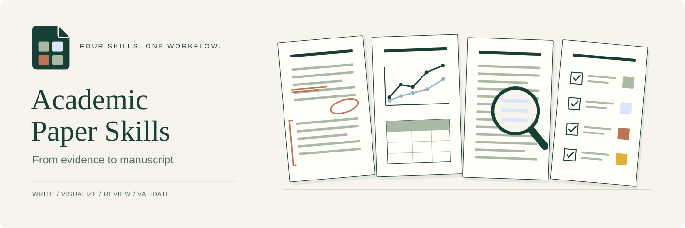

<p align="center">
  
</p>

<h1 align="center">Academic Paper Skills</h1>
<p align="center">Four coordinated Codex skills for writing, figures, review, and manuscript requirements.</p>

<p align="center">
  <a href="https://github.com/DELONG-L/Academic-Paper-Skills/actions/workflows/ci.yml"></a>
  <a href="LICENSE"></a>
  <a href="docs/getting-started.md"></a>
</p>

<p align="center"><strong>English</strong> · <a href="README.zh-CN.md">简体中文</a></p>
<p align="center"><a href="#choose-a-skill">Choose a skill</a> · <a href="#how-it-works">How they work together</a> · <a href="#quick-start">Quick start</a> · <a href="#try-it">Examples</a> · <a href="docs/architecture.md">Repository guide</a></p>

Academic Paper Skills helps researchers develop and revise academic manuscripts with Codex: organize an argument, connect claims to evidence, communicate methods and results, respond to review, and check submission requirements.

The bundle combines reusable instructions, task-specific references, and supporting tools. Bring your manuscript and source material, choose the skill for the task at hand, and work toward an output you can inspect and revise. The four skills share guidance so that prose, figures, reviewer responses, and requirement checks stay consistent.

<a id="choose-a-skill"></a>
## Choose a skill

| Your task | Skill | Typical deliverable |
|---|---|---|
| Draft or revise an argument | [paper-writing](paper-writing/SKILL.md) | Evidence-grounded sections, integrated citations, calibrated claims |
| Explain a method or present results | [paper-figures-tables](paper-figures-tables/SKILL.md) | Editable diagrams, reproducible plots, publication-ready tables |
| Inspect a draft or answer reviewers | [paper-review](paper-review/SKILL.md) | Prioritized issues, author responses, verified revision closure |
| Resolve manuscript requirements | [paper-policy](paper-policy/SKILL.md) | Applicable requirements, source checks, evidence-bounded assessment |

Author-side manuscript review is included. Assigned external peer review is outside this bundle.

<a id="how-it-works"></a>
## How the skills work together

Start with the task you have. You can revise a single paragraph, prepare one table, check a reviewer concern, or assess an entire manuscript. There is no required sequence through all four skills.

For a larger revision, `paper-review` can identify weaknesses in the argument and unresolved reviewer concerns; `paper-writing` implements the prose changes, while `paper-figures-tables` develops the supporting visual artifacts. `paper-policy` resolves applicable requirements and checks source evidence alongside that work. Each skill owns its part of the task and draws on the others when needed.

They share three principles:

- **Work from sources.** Keep claims, citations, values, and depicted mechanisms grounded in the supplied or verified material. Make missing evidence visible.
- **Adapt to the paper.** Choose structure and presentation for the research question, audience, author preferences, and applicable venue requirements.
- **Make the result inspectable.** Retain relevant sources and revision evidence, and distinguish automated checks from scientific judgments or human sign-off.

Follow the skill links above for task-specific methods, artifact conventions, and detailed checks.

<a id="quick-start"></a>
## Quick start

For a **fresh installation** on macOS or Linux, clone the repository and copy the four skill folders into Codex's skills directory:

```bash
git clone https://github.com/DELONG-L/Academic-Paper-Skills.git
cd Academic-Paper-Skills
skills_dir="${CODEX_HOME:-$HOME/.codex}/skills"
mkdir -p "$skills_dir"
cp -R paper-policy paper-writing paper-review paper-figures-tables "$skills_dir/"
```

If any of these folders already exist, use the [upgrade instructions](docs/getting-started.md#upgrade) to preserve local changes and avoid stale files. Start a new Codex task after installation.

The skill instructions are Markdown. To run the Python checks, create an isolated environment:

```bash
python3 -m venv .venv
source .venv/bin/activate
python -m pip install -r requirements-policy.txt
# Also install this for plotting and figure utilities:
python -m pip install -r requirements-figures.txt
```

Python 3.10+ is recommended; CI tests Python 3.11. Additional tools depend on the task. See [setup, upgrades, and troubleshooting](docs/getting-started.md) for the requirements of each workflow.

<a id="try-it"></a>
## Try it

**Write from evidence**

```text
Use $paper-writing to revise this introduction. Preserve the research question,
ground the contribution in the supplied results, and flag unsupported claims.
```

**Communicate methods and results**

```text
Use $paper-figures-tables to present the comparisons in these experiment results.
Choose plots or tables suited to the question, preserve uncertainty, and provide
editable or reproducible sources with captions.
```

**Close a revision**

```text
Use $paper-review to compare these reviewer comments with the revised manuscript.
Identify what is resolved, what evidence is missing, and what still needs editing.
```

**Check applicable requirements**

```text
Use $paper-policy to assess this submission against the supplied venue instructions.
Separate verified source checks from judgments that still need human evidence.
```

<a id="repository-map"></a>
## Repository map

```text
Academic-Paper-Skills/
├── paper-writing/          # Prose and argument
├── paper-figures-tables/   # Diagrams, plots, and tables
├── paper-review/           # Author review and revisions
├── paper-policy/           # Requirements and evidence checks
├── docs/                  # Bilingual guides and brand assets
├── scripts/               # Repository checks and brand generation
└── .github/               # CI and contribution templates
```

Within each skill, `SKILL.md` is the entrypoint, `references/` contains task-specific guidance, `scripts/` contains helpers where needed, and `agents/openai.yaml` supplies display metadata. The [repository guide](docs/architecture.md) explains ownership and naming conventions.

<a id="contributing"></a>
## Contributing

Corrections, reproducible bug reports, and concrete workflow improvements are welcome. Read the [contribution guide](CONTRIBUTING.md); use the issue templates to describe expected behavior and a minimal example. Keep both language editions aligned when changing public guidance.

[Changes](CHANGELOG.md) · [Brand assets and provenance](docs/brand.md) · [Third-party notices](THIRD_PARTY_NOTICES.md)

## License

[MIT](LICENSE). Independently maintained; no affiliation with or endorsement by OpenAI is implied. Workflow acknowledgments and preserved third-party notices are in [THIRD_PARTY_NOTICES.md](THIRD_PARTY_NOTICES.md).
