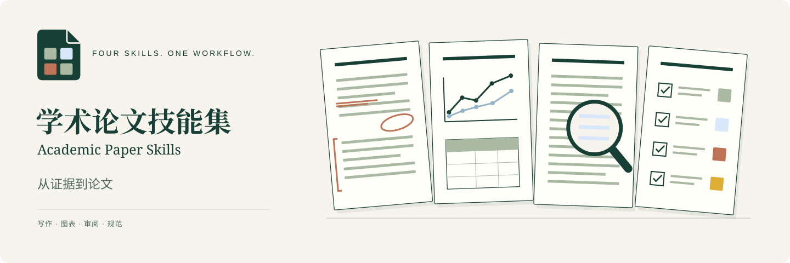

<p align="center">
  
</p>

<h1 align="center">Academic Paper Skills · 学术论文技能集</h1>
<p align="center">四个协同工作的 Codex 技能，覆盖论文写作、图表、审阅与稿件要求。</p>

<p align="center">
  <a href="https://github.com/DELONG-L/Academic-Paper-Skills/actions/workflows/ci.yml"></a>
  <a href="LICENSE"></a>
  <a href="docs/getting-started.zh-CN.md"></a>
</p>

<p align="center"><a href="README.md">English</a> · <strong>简体中文</strong></p>
<p align="center"><a href="#choose-a-skill">选择技能</a> · <a href="#quick-start">快速开始</a> · <a href="#try-it">使用示例</a> · <a href="docs/architecture.zh-CN.md">仓库指南</a></p>

提供稿件、研究证据、实验数据或审稿意见，这组技能帮助你完成有依据的正文、清晰的图表和可追溯的修订。按当前任务选择技能；安装时将四个技能一起安装，以便正确读取共享指导。

<a id="choose-a-skill"></a>
## 选择技能

| 当前任务 | 技能 | 典型产物 |
|---|---|---|
| 撰写或修改论文论证 | [paper-writing](paper-writing/SKILL.md) | 基于证据的段落、整合后的引文、与证据匹配的主张 |
| 解释方法或展示结果 | [paper-figures-tables](paper-figures-tables/SKILL.md) | 可编辑示意图、可复现数据图、可用于论文的表格 |
| 检查稿件或回复审稿人 | [paper-review](paper-review/SKILL.md) | 按重要性排序的问题、作者回复、修订闭环核验 |
| 确定稿件适用要求 | [paper-policy](paper-policy/SKILL.md) | 适用要求、源文件检查、依据证据的评估 |

本项目支持作者侧的自审与修订；受邀为他人论文进行正式同行评审不在这组技能的范围内。

<a id="quick-start"></a>
## 快速开始

在 macOS 或 Linux 上**首次安装**时，克隆仓库并将四个技能目录复制到 Codex 的技能目录：

```bash
git clone https://github.com/DELONG-L/Academic-Paper-Skills.git
cd Academic-Paper-Skills
skills_dir="${CODEX_HOME:-$HOME/.codex}/skills"
mkdir -p "$skills_dir"
cp -R paper-policy paper-writing paper-review paper-figures-tables "$skills_dir/"
```

如果这些目录已经存在，请按照[升级说明](docs/getting-started.zh-CN.md#upgrade)保留本地改动并避免遗留文件。安装后新建一个 Codex 任务。

技能指令本身是 Markdown。运行 Python 检查工具时，先创建独立环境：

```bash
python3 -m venv .venv
source .venv/bin/activate
python -m pip install -r requirements-policy.txt
# 使用绘图与图像辅助工具时再安装：
python -m pip install -r requirements-figures.txt
```

建议使用 Python 3.10+；CI 使用 Python 3.11 测试。ImageGen 设计阶段需要可用的 `imagegen` 技能和图像生成工具；编译 LaTeX 项目需要相应编译器。详见[安装、升级与排错指南](docs/getting-started.zh-CN.md)。

<a id="try-it"></a>
## 使用示例

**根据证据修改正文**

```text
使用 $paper-writing 修改这段 Introduction。保留研究问题，依据提供的结果
表述贡献，并指出证据不足的主张。
```

**设计论文图**

```text
使用 $paper-figures-tables 根据这一节设计跨双栏的方法总览图。
先确定组件与连接，再用 ImageGen 设计并重建为可编辑 SVG。
检查信息密度，以及稿件最终刊载尺寸下的可读性。
```

**核验修订是否闭环**

```text
使用 $paper-review 对照审稿意见和修订稿，指出哪些问题已经解决，
哪些还缺证据，哪些仍需要修改。
```

**检查适用要求**

```text
使用 $paper-policy 依据提供的会议指南检查这份投稿材料。
区分已经验证的源文件检查，以及仍需人工证据支持的判断。
```

<a id="how-it-works"></a>
## 工作方式

| 范围 | 工作方法 |
|---|---|
| 正文写作 | 从问题与证据出发，按论证和投稿要求组织结构。 |
| 概念图 | 内容与版面定义 → ImageGen 设计 → 可编辑 SVG → 逻辑、视觉与刊载尺寸检查。 |
| 实验图 | 从真实数据生成；默认**单栏每行至少 2 个子图，跨双栏每行至少 4 个子图**。 |
| 实验表格 | 单栏小表不设额外密度门槛；跨双栏大表检查信息密度。 |
| 审阅与要求检查 | 问题与判断可追溯到来源。自动检查和代理检查不等于科学结论成立或人工签核。 |

子图数量是本技能的默认排版规则，不是会议规范。必须保持可读性和比较意义，不能编造证据或重复子图凑数。明确的用户选择和适用的会议要求优先。详见[概念图流程](paper-figures-tables/references/conceptual-figures.md)与[风格指南](paper-figures-tables/references/conceptual-style-reference.md)。

<a id="repository-map"></a>
## 仓库结构

```text
Academic-Paper-Skills/
├── paper-writing/          # 正文与论证
├── paper-figures-tables/   # 示意图、数据图与表格
├── paper-review/           # 作者侧审阅与修订
├── paper-policy/           # 稿件要求与证据检查
├── docs/                  # 双语指南与品牌资源
├── scripts/               # 仓库检查与品牌资源生成
└── .github/               # CI 与协作模板
```

每个技能以 `SKILL.md` 为入口，`references/` 存放任务指导，按需提供的 `scripts/` 存放辅助程序，`agents/openai.yaml` 定义展示信息。[仓库指南](docs/architecture.zh-CN.md)说明目录职责与命名约定。

<a id="contributing"></a>
## 参与改进

欢迎纠错、可复现的问题报告和有具体使用场景的工作流改进。请阅读[贡献指南](CONTRIBUTING.zh-CN.md)，通过问题模板描述预期行为与最小示例。修改公开使用说明时，请同步中英文版本。

[变更记录](CHANGELOG.md) · [品牌资源与来源](docs/brand.md) · [第三方说明](THIRD_PARTY_NOTICES.md)

## 许可

采用 [MIT 许可](LICENSE)。本项目独立维护，不代表与 OpenAI 存在隶属或背书关系。仓库不分发参考论文截图。工作流致谢与保留的第三方许可见[第三方说明](THIRD_PARTY_NOTICES.md)。
